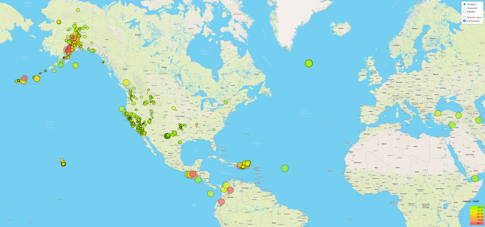
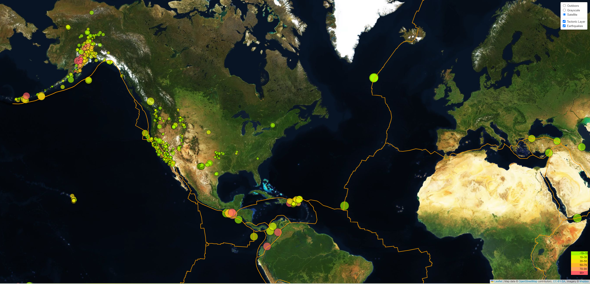

# Module 15 Challenge - Leaflet Challenge
The United States Geological Survey(USGS), is responsible for providing scientific data about natural hazards, the health of our ecosystems and environment, and the impacts of climate and land-use change. Their scientists develop new methods and tools to supply timely, relevant, and useful information about the Earth and its processes.

The USGS is interested in building a new set of tools that will allow them to visualize their earthquake data. They collect a massive amount of data from all over the world each day, but they lack a meaningful way of displaying it.

This is an interative dashboard to explore the [USGS All Earthquakes from the Past 7 Days](https://earthquake.usgs.gov/earthquakes/feed/v1.0/summary/all_week.geojson) dataset. This dashboard contains a map to visualize USGS data that will allow them to better educate the public and other government organizations and hopefully secure more funding on issues facing our planet.

## Prerequistes
1. VSCode
2. Any Browser example: Google Chrome, Firefox etc
3. Mapbox API key

## Instructions
The instructions for this activity are broken into two parts:

   - Part 1: Create the Earthquake Visualization

   - Part 2: Gather and Plot More Data 

## Part 1: Create the Earthquake Visualization
1. First task is to visualize an earthquake dataset and complete the following steps:
   - Get the dataset by going to the link [USGS All Earthquakes from the Past 7 Days](https://earthquake.usgs.gov/earthquakes/feed/v1.0/summary/all_week.geojson) dataset.
2. Import and visualize the data by doing the following:
   - Using Leaflet, create a map that plots all the earthquakes from your dataset based on their longitude and latitude.
   - The data markers should reflect the magnitude of the earthquake by their size and the depth of the earthquake by color. Earthquakes with higher magnitudes should appear larger, and earthquakes with greater depth should appear darker in color.
3. Include popups that provide additional information about the earthquake when its associated marker is clicked.
4. Create a legend that will provide context for your map data.
5. Visualization would look something like the map below:

## Part 2: Gather and Plot More Data
1. Plot a second dataset on the map to illustrate the relationship between tectonic plates and seismic activity.
2. Pull in this dataset and visualize it alongside the original data.
3. Data on tectonic plates can be found at [Tectonic Plates Data](https://github.com/fraxen/tectonicplates)
4. Perform the following tasks using the tectonic plates data above:
   - Plot the tectonic plates dataset on the map in addition to the earthquakes.
   - Add other base maps to choose from.
   - Put each dataset into separate overlays that can be turned on and off independently.
   - Add layer controls to your map.
5. Below is the image of how this map would look:
      
## Code organization
1. The API_KEY required to use MapBox is located under "./static/js/config.js"
2. Javascript to visualize Earthquake overalay layer on three base layer options (Outdoors, Grayscale, and Satellite) is in "./Leaflet-Part-1/earthquake.js"
3. Javascript to visualize Tectonic overlay layer on three base layer options (Outdoors, Grayscale, and Satellite)  is in "./Leaflet-Part-2/tectonic.js"
4. "./Images" folder contains snapshots of the different visualizations using overlay layers (Earthquakes and Tectonic) on base layers.

## How to execute code?
1. **Important** - Please add **API_KEY** in "./static/js/config.js". Without the API_KEY, the site will not show map visualization. It will just show Eathquake data.
2. Click on this link [URL](https://nidhi0684.github.io/leaflet-challenge/) to launch visualization for Earthquake and Tectonic using leaflet.
3. By deafult, Outdoors as base layer and Earthquakes data as the overlay will be selected. 
4. Other options to select for base layer are Grayscale and Satellite.
5. To see Tectonic layer, select "Tectonic Layer" checkbox. 
6. **Note** - If you don't see "Tectonic Layer" option, please refresh the page.

